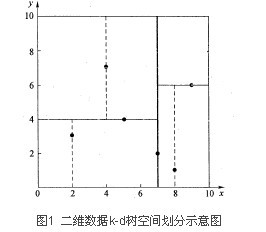
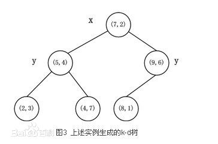
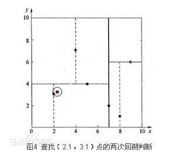
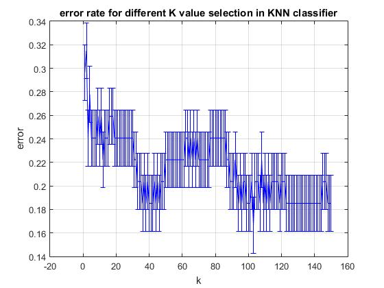
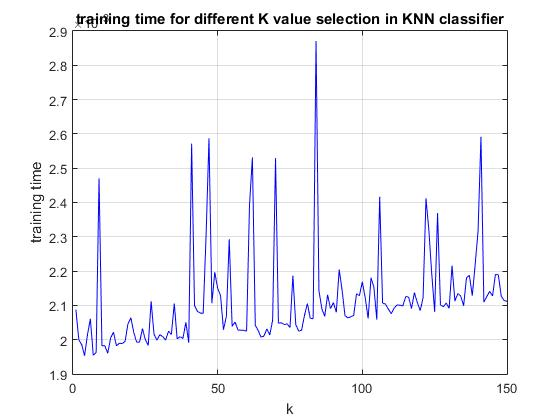
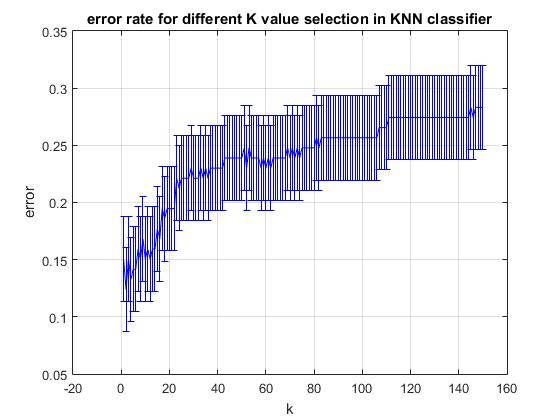
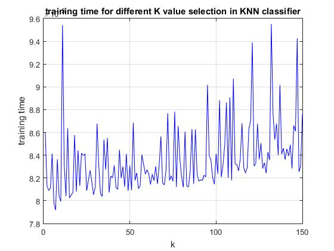
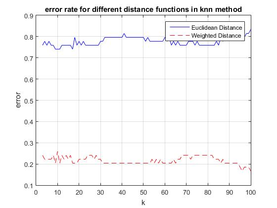
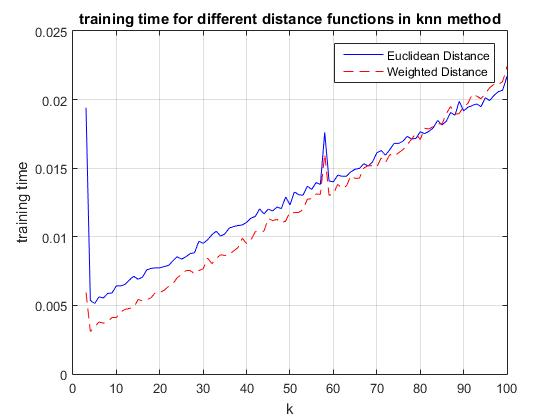
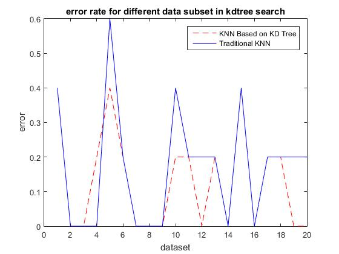

# K-Nearest Neighbors (KNN) Algorithm Research
===========================
K-Nearest Neighbor algorithm is one of the most widely used classification technology in machine learning, which involves characteristics such as simple, easy to understand, easy to implement, no estimation parameters and no data training. This project introduces the fundamental theory of KNN algorithm firstly. Then it focuses on many improving methods for shortcoming of KNN. This project discusses mainly from aspects of K-selection, distance calculation improvement and KNN based on good data structure. It plays an instructional role in academic study and practical application of KNN classifier algorithm. Finally, this project summarizes that suitable K-selection, weighted adjusted distance calculation and KNN classifier based on KD tree data structure will effectively improve the accuracy of KNN classifier.

###　　　　　　　　　　　　Author:Liu Liu
###　　　　　　　　　 E-mail:liuliu9309212@gmail.com

===========================

------
# 1.  Introduction

Classification is the core and fundamental technology of data mining, which is used widely in business operations in many areas of government policy management, scientific research and industrial enterprises. At present, the main classification techniques include decision trees, Bayes classifier, KNN classifier, artificial neural networks and so on.  Among these methods, KNN classifier is a simple, effective and non-parametric method, now widely used in text classification, pattern recognition, image   spatial classification and many other fields. However, there are some shortcomings of KNN classifier such as overhead calculation and slow running speed. Therefore, many researchers proposed improving methods for traditional KNN classifier. 

## 1.1  K-Nearest Neighbor Algorithm

he principle of KNN classifier is very simple. Firstly, it searches k nearest neighbors of the classified object in the training data set. Then vote according to the classification properties of these neighbors. Finally, assign the predicted value to the classified object, which is:

## 1.2  Pros and Cons of KNN classifier

The advantages of KNN classifier are obvious:

(1)	KNN classifier has higher classification accuracy than other classification.

(2)	It is not necessary to know the distribution of property value for KNN classifier. Most other classifiers such as Bayes classifier requires distribution of property value before making prediction.

(3)	KNN classifier is still effective, given a sufficiently large training dataset or the massive database.

(4)	It is simple to construct and easy to implement for KNN classifier.

However, there are some disadvantages:

(1)	Overhead calculation and storage.

(2)	Low classifying speed.

(3)	Low accuracy rate due to the fact that property is equivalent weights.

# 2.  Background

This project focuses on many improving methods for the shortcomings of KNN classifier. It mainly discusses K-selection, weighted distance calculation and KD tree data structure. 

## 2.1  K-Selection

As a result of the prediction of target point is determined by vote of K nearest neighbor values. KNN classifier algorithm effect largely depends on the value of K chosen. In the past, people decide K selection mainly based on experimental experience. If the value of K selected is too small (i.e. the number of neighbors was too small), it will reduce the accuracy of classification. If the value of K selected is too large, it will be likely to cause increased noise data and reduce the accuracy of classification.

*Figure 1*. An example of KNN classifier. Test sample (green circles) should be classified as either a first class (blue) or second class (red). If K = 3 (solid line circle), because there are only 2 triangles and 1 square within a circle of solid line, it will be classified as the second class. If K = 5 (dotted line circle), it will be classified as the first class because of 3 squares and 2 triangles within a circle of dotted line circle. (Resource from Wikipedia: https://zh.wikipedia.org/wiki/File:KnnClassification.svg).

In the most extreme case, K value is equal to the number of all the samples in the database, so the prediction of test sample is a global optimal solution. Otherwise, the prediction of test sample is local optimal solution. Therefore, the parameter K selection is the compromise between global optimal solution and local optimal solution. This project uses experiments of several different K values for test sample and choose the K value for the result of minimum error rate.

## 2.2  Weighted Distance Calculation

KNN classifier calculates the distance using traditional Euclidean distance function, which gives equal weight to each example. In this case, the distance between neighbors will be dominated by a large number of irrelevant property and classification accuracy will be greatly affected. So researchers propose that introducing weight when calculating distance to improve the performance of KNN classifier. The key on how to improve KNN classifier is to determine which property is strong correlated and which property is weak correlated or uncorrelated.

This project adopts an extended weighted distance algorithm: giving different weights according to the distance between text sample and K nearest neighbors and setting the weight is reciprocal of square of the distance between two examples. The weight w_i for i-th nearest neighbor is defined as follow:

w_i=1-((dist(x',x_i))⁄(∑▒dist))                (1)

dist(x^',x_i) is the distance between test sample and i-th nearest neighbor. Then the prediction y ̂ is made by the majority weighted voting:

y ̂=round(∑▒〖((w_i×y_i)⁄(K))〗)                  (2)

y_i is the label of i-th nearest neighbor. It can be seen that a neighbor with smaller distance to test sample is weighted more heavily than that with larger distance to test sample. The weighted distance method has higher classification accuracy than traditional KNN classifier. 

## 2.3  KD Tree Data Structure

KD tree (K-Dimensional Tree) is a data structure of k-dimensional data space division, which is mainly used in multi-dimensional space data search. 

### 2.3.1  BINARY SEARCH TREE

Binary search tree is a special kind of binary tree, in which the storage rule is: in a binary search tree, each node n must follow the following two rules: 

(1)	elements of each node in the left subtree of n are less than or equal to node n

(2)	elements of each node in the left subtree of n are greater than node n

### 2.3.2  KD TREE CONSTRUCTION

KD-Tree means the K-dimensional binary search tree, in which the nearest neighbor of K-dimensional data can be searched quickly. Different with binary search tree, each node in KD tree represents a k-dimensional data and each node of the tree have made branches decisions based on this level of resolution. 

*Figure 2*. An example of KD tree construction. (Resource from Wikipedia: https://en.wikipedia.org/wiki/K-d_tree)

Suppose there are six two-dimensional data points {(2,3), (5,4), (9,6), (4,7), (8,1), (7,2)}, the data points are stored in two dimensional space. The steps of KD tree construction are:

(1)	Determine the value of the split field. Calculate variance of the data in x and y axis and know that the greatest variance is in x axis. So choose x axis for the split field.

(2)	Determine the value of node data. Select the median value 7 according to the sorted values in x axis 2,4,5,7,8,9 and the node data is (7, 2). Hyperplane that splits the node is through (7, 2) and perpendicular to the x-axis linear x = 7.

(3)	Determine left and right subspace. The portion of x<=7 is the left subspace, which involves three nodes {(2, 3), (5, 4), (4, 7)}. Another part is right subspace containing two nodes {(9, 6), (8, 1)}.

(4)	Call KD tree repeatedly and make the left and right subspace further subdivided until there is only one data point in the subspace.

*Figure 3*. The result of KD tree construction. (Resource from Wikipedia: https://en.wikipedia.org/wiki/K-d_tree)

### 2.3.3  KD TREE SEARCH NEAREST NEIGHBOR

Suppose the test point is (2.1, 3.1). By binary search and along the search path he nearest approximate point can be quickly searched, which is a leaf node (2, 3). However, the leaf node might not be the nearest point, and the nearest point should located in the circle, whose the radius is the distance between the leaf node and test node. So it is necessary to adopt ‘backtracking’ search. 

The algorithm reverse to look up along the search path whether there is a point more near to the test point. It is obvious that the nodes in search path are {(7,2), (5,4), (2,3)}. Firstly, suppose (2,3) as the current nearest neighbor and calculate the distance between (2.1,3.1) and (2,3), which is 0.1414. Then go back to the parent node, judging whether there is a point that is more near to the test point in the other subspace. If yes, set the parent node as the current nearest neighbor and calculate the new distance then continue to backtrack. Finally, go back to the root node (7,2) and judging whether there is a nearer point that others. 

*Figure 4*. The backtracking for the test point. (Resource from Wikipedia: https://en.wikipedia.org/wiki/K-d_tree)

So far, the nodes in search path have been all completed backtracking and finish the whole search. The node point (2, 3) is the nearest neighbor.

# 3.  Experiments

This project designs the experiments in order to improve KNN classifier through K-selection, weighted distance and KD tree data structure.

## 3.1 K-selection

Firstly, this project chooses the dataset heart to implement KNN classifier, in which K value is selected from 1 to 150 since that the number of examples is 270 and selecting about half of 270 for K value maximum can avoid the global optimal solution.

*Figure 5*. Error rate for K value from 1-150 in KNN classifier. 

From the line chart, it can be seen that KNN classifier can achieve the lowest error rate given that K selection is approximately 105. The lowest error rate is 0.16. Meanwhile, when selecting K value of about 10, it performs the highest error rate, which is 0.34. This proves that different K selection results in different error rate.

However, this does not mean 105 is the best K selection in heart dataset to predict test example. It is obvious that there is another metrics should be considered to determine K value, training time. Because that larger K value implies more complex computation. Consider training time for different K value selection in KNN classifier:

Figure 6. Training time for K value from 1-150 in KNN classifier.

This line chart illustrates the change of training time with increasing of K value. It can be seen that training time reaches at an extremum when K is approximately 10, 40, 60, 70 and 80. Furthermore, training time shows a slight growth trend when K increases between 1 and 150. This is because that KNN classifier needs to compute larger number of nearest neighbour with the increasing of K and spends more time to train data. From these figures, it can be concluded that 150 is the best K value in heart dataset.

Then it is needed to change the dataset to further research the K-selection. Choose dataset breast and get the results:

*Figure 7*. Error rate for K value from 1-150 in KNN classifier.

Differently, the error rate almost keeps increasing with the growth of K. Therefore, the lowest error rate is about 0.13 when K is 3. Similarly, consider training time for K value in dataset breast:

*Figure 8*. Training time for K value from 1-150 in KNN classifier. 

It can be seen the same trend that increasing training time when K is increasing. And the extremums appear at 10, 80 and 90. So 3 is the best K to predict test example.

## 3.2 Weighted Distance KNN Classifier

From chapter 2, the algorithm of weighted distance KNN classifier has been introduced. Choose dataset heart to implement comparison between Euclidean distance function and weighted distance function.

*Figure 9*. Error rate for 2 distance function in KNN classifier with increasing of K.

Compared with Euclidean distance function, it is obvious that KNN classifier with weighted distance function performs much better than KNN with Euclidean distance. Basically, comparing the error rate of KNN classifier with Euclidean distance, which of KNN with hybrid distance is lower in the K value from 1 to 100. Similarly, consider the training time of 2 different KNN classifier:

Figure 10. Training time for 2 distance function in KNN classifier with increasing of K

Due to the complexity of weighted distance function, KNN classifier does not spends much less time on training and predicting test sample. Therefore, the speed of KNN classifier with weighted distance is still higher than traditional KNN classifier.

## 3.3 KD Tree Data Structure

KD tree is a good data structure to represent the data. The key on how to implement KNN classifier using KD tree is the KD tree construction. This project implements KNN classifier based on KD tree compared with traditional KNN classifier and calculate the error rate. Meanwhile, it adopts cross-validation to split data into 20 folds, which can get the stable and reliable result. Choose K for 30:

*Figure 11*. Error rate for different data subset in KNN classifier based on KD tree compared with traditional KNN classifier.

According to the line chart, KNN classifier based on KD tree performs better than traditional KNN classifier in most data subset.

# 4.  Analysis

## 4.1  K-selection

The experiments show that K value is an important key to improve error rate and training time in KNN classifier. This project chooses the best K value by calculating error rate and training time in each K from 1 to 150. 
From the experimental results, it can be seen that the best K value if different in different dataset. Therefore, calculating the error rate with different K value can help to determine the best K.

## 4.2  Weighted Distance 
KNN with weighted distance greatly improves the accuracy of experiments because that the more near neighbour play a more important role in predicting the test example. Weighted distance calculation help to determine which property is strong correlated and which property is weak correlated or uncorrelated.
Weight added to predict test sample means more complex computation in KNN classifier. But complexity does not affect the running speed.

## 4.3  KD Tree
KD tree is a clear data structure. KNN classifier based on KD tree perform better than traditional KNN and make search the nearest neighbour efficiently. Unfortunately, this project dose not achieve the efficiency of KD tree to predict test sample due to the large number of backtracking affect the running speed.

# 5.  Conclusion

This project systematically introduces the basic principle of KNN classifier, as well as the makes improvements for the shortcomings of KNN classifier. These improvements include K-selection, weighted distance and KD tree data structure.

Experiments prove that a suitable K value selection can obviously improve the performance of KNN classifier, especially in reducing error rate and training time. Furthermore, KNN classifier with weighted distance calculation spend less time on training data and can make improvement in lower error rate. KD tree is a good data structure to enhance performance but a large number of data backtracking will result in low running speed. 

However, there are still some drawbacks in the improved KNN classifier such as training time. This project does not significantly improve the running speed.  In the future, the potential work needed is to overcome the shortcoming of speed and research further to find more efficient algorithms for machine learning. 

# References
Gou, J. Du, L. Zhang, Y and Xiong, T.(2012) A New Distance-weighted k -nearest Neighbour or Classifier Journal of Information & Computational Science 9: 6 (2012) 1429–1436.
Zhang, J. and Mani, I.(2003)  kNN approach to unbalanced data distributions a case study involving information extraction Proceedings of Workshop on Learning from Imbalanced Datasets. 2003.
Zhang, M. and Zhou Z.(2007) ML-KNN: A lazy learning approach to multi-label learning. Pattern recognition, 2007, 40(7): 2038-2048.
Zhang, S. (2012) Nearest neighbor selection for iteratively kNN imputation. Journal of Systems and Software, 2012, 85(11): 2541-2552.

